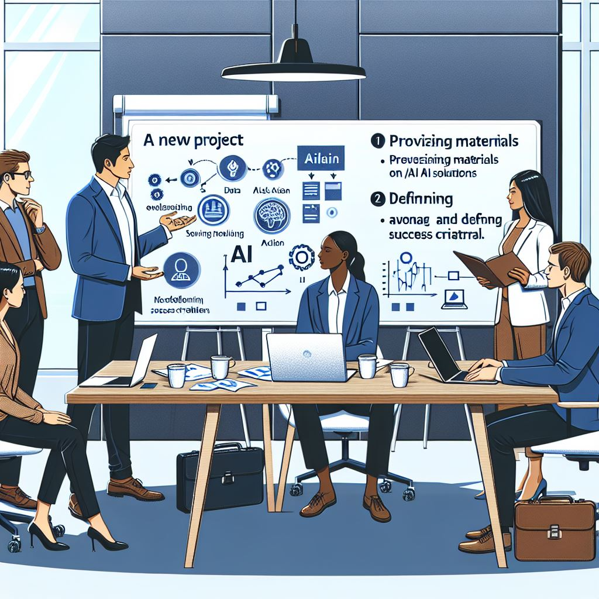

# Week 1: Setup & Background
Week 1 focuses on understanding the partner companies and identifying business growth opportunities. To achieve this, it's essential to engage in conversations and clarify the metrics for business growth. The content for Week 1 provides a pitch deck to aid in identifying growth opportunities and understanding. This pitch deck serves as the first step to discuss and confirm with the partner what workloads, including AI workloads on Microsoft Azure and other PaaS/IaaS workloads, are suitable after conversations about the partner and business growth opportunities.  

# Week 1: Goals
- Understand the partner's business/solution
- Pitch deck about Azure workloads for AI Intelligence Application
  - Azure AI & Azure App & Azure Data Platform

# Contents: Walk through AI-Pex and Week 1
You can use the content of [Week 1](https://github.com/MamoruKuroda/AI-Pex-for-ISV-Partners/blob/7a6c82eaa82c48d917b289d4c5543622cbe7e852/Week1/AI-Pex%20-%20Week%201.pdf) to understand partner's business and opportunity to growth.

# Next Step
In Week 1, we understood your business goals and growth opportunities together with you. Let's move on to [Week 2](https://github.com/MamoruKuroda/AI-Pex-for-ISV-Partners/blob/26fcbf6bc3fa855d8439ebf9b52526d26511f212/Week2/Readme.md) and dive deep into the world of design-led thinking. Here is the content for [Week 2](https://github.com/MamoruKuroda/AI-Pex-for-ISV-Partners/blob/26fcbf6bc3fa855d8439ebf9b52526d26511f212/Week2/Readme.md).
