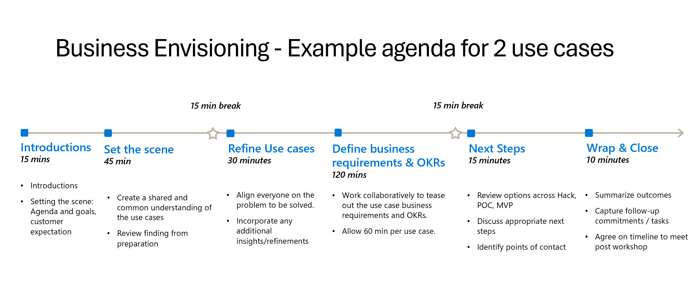
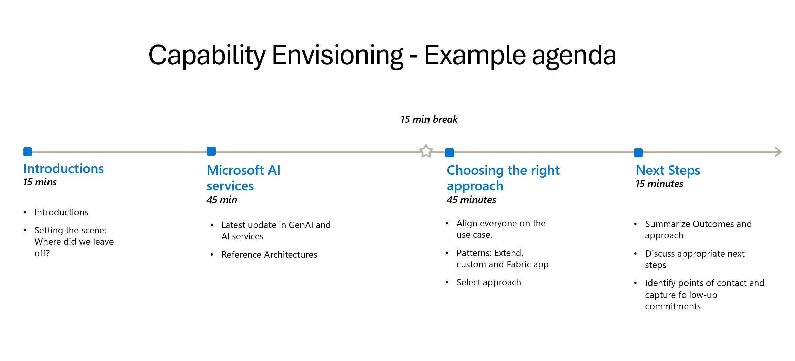

 
# Week 2: Design Thinking & Scenario Definition

Welcome to Week 2 of our 5-week program for SDC partners. This week, we will dive into the world of Design Thinking and Scenario Definition. Design Thinking is a user-centric approach to problem-solving that emphasizes understanding the needs and experiences of end-users. By keeping the user at the core of the design process, we can create innovative solutions that are not only functional but also desirable.

This week, we will guide you through the principles of Design Thinking and help you envision solutions that align with your customers' needs and business goals.

# Table of Contents
- [Week 2: Design Thinking & Scenario Definition](#week-2-design-thinking--scenario-definition)
  - [Design-led Thinking](#design-led-thinking) 
- [Goals](#goals)
  - [Objectives & Outcomes](#objectives--outcomes)
- [Overall Process of an Envisioning Workshop](#overall-process-of-an-envisioning-workshop)
  - [Business Envisioning](#business-envisioning)
    - [AI Discovery Cards Workshop](#ai-discovery-workshop)
    - [Business, Experience, Technology Framework](#business-experience-technology-framework)
  - [Capability Envisioning](#capability-envisioning)
- [Helpful Resources](#helpful-resources)
- [Final Deliverables & Expected Outcomes](#final-deliverables--expected-outcomes)
- [Next Step](#next-step)
---

## Design-led Thinking
Design-led thinking is a human-centric approach that focuses on exploring challenges and issues from a people-first perspective. This approach:
- Transforms your approach to problem-solving, allowing you to determine the root cause.
- Increases collaborative brainstorming, user adoption, and prototype design.
- Helps you build deeper relationships with partners/customers.
- Reduces risk for new ideas and project changes.
- Ensures the outcome meets the objectives and client requirements.

# Goals
An envisioning workshop is the first step in defining what the future of your business can be. Design Thinking combines creative and critical thinking, fostering ideation and organizing ideas to drive decision-making and situational improvements. At the conclusion of the workshop, the journey continues with the creation of a business case, technology roadmap, and change-management plan.

## Objectives & Outcomes
- Explore your business's strategic priorities and current challenges.
- Identify your business's key initiatives that will align with the partner/customer strategy.
- Highlight the top initiatives that will bring the highest value in the shortest time.
  
# Overall Process of an Envisioning Workshop
The envisioning workshop consists of two parts: **Business Envisioning** and **Capability Envisioning**.

In the Business Envisioning workshop, Microsoft and you, the SDC partner, get together to brainstorm, evaluate, and prioritize use cases to identify initiatives for immediate collaboration.

The Capability Envisioning workshop follows, allowing you to understand what tools are available and choose the best approach for selecting your use case.

## Business Envisioning

The goal of the Business Envisioning workshop is to identify potential AI and GenAI use cases relevant to your industry and business. To identify problem statements, you can use these techniques:

- **"Rose, Thorn, Bud"** to identify what is going well, what is not going well, and potential opportunities.
- **"Clustering"** to group your ideas into clusters and themes.
- Convert clusters into problem statements starting with **"How might we...?"**
  
If your organization already has a few AI use cases in mind that you have previously envisioned, please let your Microsoft contact know about these use cases.

### AI Discovery Cards Workshop
Using AI Discovery Cards and Design Thinking principles, the AI Discovery Workshop offers a hands-on approach to identifying the best use cases for adopting AI to enhance innovation, improve efficiency, and boost overall business performance.

The AI Discovery Cards Workshop can be included as part of the Business Envisioning Workshop.  During the Business Envisioning Workshop, these cards can be used to facilitate discussions and identify potential AI applications that align with strategic business objectives. The AI Discovery Cards workshop involves hands-on activities that engage participants in design thinking and envisioning techniques. This practical approach enhances the Business Envisioning Workshop by allowing participants to gain a holistic overview of existing AI solutions and explore actionable ways to embed AI into their workflows.

Use the AI Discovery Cards when you are in the early stages of exploring AI possibilities and need to uncover new use cases without tying them to specific products initially. When you need to brainstorm and generate multiple AI use cases, the AI Discovery Cards are ideal for facilitating meaningful conversations and identifying innovative solutions. Use the AI Discovery Cards to engage partners in discussions about AI capabilities and how they can be applied to their business challenges

For in-person workshops, physical cards containing examples of various AI use cases can facilitate the brainstorming process. For virtual workshops, an interactive Mural board ([Mural Template](https://app.mural.co/template/3d5554f8-0eea-4fb2-a5ec-8abe76c227c4/1f805d9f-cb97-4813-ab66-a507111d3106)) or Microsoft Whiteboard will be used to represent the discovery cards. The Mural whiteboard template is a public Mural template. You'll need a license to create a Mural dashboard. 

You can read more about the AI Discovery Workshop and its implementation in this article: [Unlocking AI Potential: An Overview of the Microsoft AI Discovery Workshop](https://www.linkedin.com/pulse/unlocking-ai-potential-overview-microsoft-discovery-workshop-broschk-9lo8f/). 

### Business, Experience, Technology Framework
The second goal of the Business Envisioning session is to evaluate and prioritize the use cases identified. We recommend using the **Business, Experience, Technology (BXT) framework**. 

You can read more about Business Envisioning and the BXT framework in this article: [Evaluate and Prioritize an AI Use Case with Business Envisioning](https://learn.microsoft.com/en-us/microsoft-cloud/dev/copilot/sdc/Business-Envisioning).

Make sure that you have secured sponsorship from senior business decision-makers for the workshop. This is critical to success. Secure a cross-section of business stakeholders, including individual contributors and managers. It is very important to have the right stakeholders from your organization participating in this Business Envisioning workshop. Include these roles: executive sponsors, business unit or organization executives, business process owners, and frontline associates.

[PDF of Sample deck for Business Envisioning](Business%20Envisioning%20-%20Customer%20Deck.pdf)
> **Note**: If you are unable to view the downloaded materials, please contact your Microsoft representative.

## Capability Envisioning
After selecting a prioritized use case, it is time to decide how to develop it. SDCs can choose from three main approaches: extend or adopt a Microsoft Copilot, build a custom copilot, or create an application on Fabric. Learn more in this article: [Creating Generative AI Experiences with the Microsoft Cloud: A Guide for SDCs](https://learn.microsoft.com/en-us/microsoft-cloud/dev/copilot/sdc/sdc-extensibility-story).

These approaches are not mutually exclusive but offer flexibility through a broad spectrum of tools for developing your application. In the following section, we explore how each approach fits into the development process, along with tools and considerations for choosing the best fit for your application. Our example scenario demonstrates the range of effort and resources involved in application development while highlighting how your choice of approach can impact the development process.

Target Audience for the Capability Envisioning Workshop:
- Chief Information and Technology Officers
- IT and Cloud Administrators and DevOps Roles
- Software Developers and Engineers
- Data Engineers and Scientists
- Enterprise Architects

You can read more about Capability Envisioning in this article: [Choosing an approach to AI-enabled application development with Capability Envisioning](https://learn.microsoft.com/en-us/microsoft-cloud/dev/copilot/sdc/Capability-Envisioning).

# Helpful Resources
- Design-thinking approach: Double Diamond "discover, define, develop, and deliver". [LinkedIn Learning on Design Thinking](https://www.linkedin.com/learning/topics/design-thinking)
- PowerPoint template: [Microsoft SDC AI Envisioning Day - Identify and Prioritize Use Cases for AI Solutions](PPT%20ISV%20AI%20Envisioning.pptx)
- Online Learning Events:
  - [Microsoft SDC AI Envisioning Day: Identify and Prioritize Use Cases for AI Solutions](https://events.microsoft.com/en-us/allevents/?clientTimeZone=1&search=Microsoft%20SDC%20AI%20Envisioning%20Day)
  - [Microsoft SDC AI Envisioning Day: Get the Framework to Develop AI Solutions](https://events.microsoft.com/en-us/allevents/?search=Microsoft%20SDC%20AI%20Envisioning%20Day:%20Get%20the%20Framework%20to%20Develop%20AI%20Solutions&clientTimeZone=1)
> **Note**: If you are unable to view the downloaded materials, please contact your Microsoft representative.
# Final Deliverables & Expected Outcomes

By the end of Week 2, partners should have:
- A top-priority AI use case that offers the best business value and impact, with a minimum viable product (MVP) that is technically feasible to implement within a set timeframe (ideally 3-5 weeks).
- Identified and aligned the necessary resources from both the SDC partner and Microsoft to collaboratively build the MVP of the selected prioritized use case.
- Commitment to deliver the MVP and publish it as a transactable solution on the Microsoft Commercial Marketplace.

# Next Step
Once we have resource alignment between the SDC partner and Microsoft, we will proceed to build an MVP of the selected prioritized use case, which will be covered in [Week 3](https://github.com/microsoft/AI-Pex-for-SDC/tree/main/Week3).
