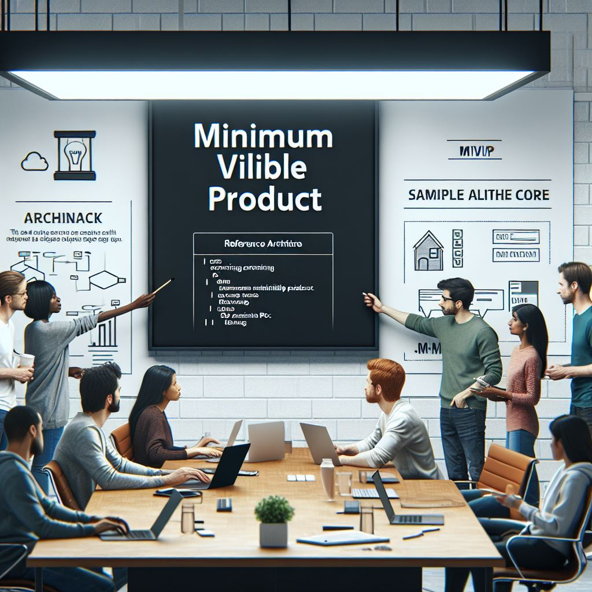

# Week 3: Building MVP

Week 3 focuses on helping partners build a Minimum Viable Product (MVP) using Microsoft Azure. This phase is essential for establishing a working prototype that demonstrates core AI capabilities. By the end of this week, partners should have a functional AI application, laying the foundation for further development and scaling.

# Week 3: Goals

The primary objective of this week is to provide partners with hands-on experience in building an MVP leveraging Microsoft Azure services. This ensures they can move from concept to a functional prototype efficiently.

Key goals include:
- **MVP Development:** Equip partners with the necessary skills and resources to build an MVP on Microsoft Azure with minimal reliance on external support.
- **Practical Hands-On Experience:** Conduct real-world workshops and proof-of-concept (PoC) exercises that guide partners through the AI solution deployment process.
- **Integration:** Enhance the understanding of integrating Azure AI workloads into scalable solutions, setting the stage for future expansion.

# Overview
By the end of Week 3, partners should have a Minimum Viable Product (MVP) of their AI application. This stage involves designing, implementing, and validating a basic but functional version of the solution.

Microsoft provides structured guidance through reference architectures, hands-on workshops, and sample code to help partners build their AI solutions. This week’s sessions focus on AI model integration, Azure Data and AI workloads, and best practices for developing enterprise-ready applications.

## This week focuses on:
- Understanding AI reference architectures and solution accelerators.
- Participating in hands-on workshops to gain experience in AI MVP development.
- Utilizing sample code and pre-built templates to accelerate AI application deployment.
- Learning how to integrate AI models and services effectively into a scalable architecture.

# Key Topics & Activities

## 1. Reference Architecture for AI MVPs
- **Session Objective:** Understand and apply AI solution reference architectures to accelerate MVP development.

### Key Discussion Points:
- **AI Reference Architecture Overview:** Explore Microsoft’s best practices for AI workloads.
- **Component Breakdown:** Learn about key components, including data ingestion, model training, and deployment.
- **Pre-Built AI Accelerators:** Utilize GitHub repositories and solution templates to speed up MVP development.

### Related GitHub Repository:
- [Chat with Your Data Solution Accelerator](https://github.com/Azure-Samples/chat-with-your-data-solution-accelerator)
- [Build Your Own Copilot Solution Accelerator](https://github.com/microsoft/Build-your-own-copilot-Solution-Accelerator)

### Hands-on Activity:
- Analyze a reference architecture diagram and identify key AI components.
- Deploy a simple AI MVP using Azure AI and Data services.

---

## 2. Workshops and Hands-On Sessions
- **Session Objective:** Gain practical experience in AI MVP development through guided exercises.

### Key Discussion Points:
- **Conversational AI Development:** Learn how to create AI-powered chatbots and virtual assistants.
- **AI Model Deployment:** Understand the steps to deploy AI models using Azure Machine Learning and Azure Functions.
- **Data Processing and Storage:** Explore best practices for handling and storing AI training data efficiently.

### Related GitHub Repository:
- [Aspire Shop with Semantic Kernel](https://github.com/vicperdana/AspireShopWithSK)

### Hands-on Activity:
- Build a conversational AI chatbot and integrate it with Azure OpenAI.
- Train and deploy an AI model using Azure Machine Learning.
- Implement data storage and retrieval mechanisms for AI applications.

---

## 3. Sample Code for AI MVP Development
- **Session Objective:** Utilize pre-built sample code to accelerate MVP development.

### Key Discussion Points:
- **Code Reusability:** Learn how to modify existing AI code templates to fit business use cases.
- **AI Model Integration:** Implement AI-powered features into applications efficiently.
- **Best Practices for AI Deployment:** Understand versioning, testing, and monitoring of AI applications.
  
  ### Related GitHub Repository:
- [Aspire Shop with Semantic Kernel](https://github.com/vicperdana/AspireShopWithSK)
- [Knowledge Mining Solution Accelerator](https://github.com/microsoft/Conversation-Knowledge-Mining-Solution-Accelerator)

### Benefits:
:white_check_mark: Start AI projects with pre-tested code to reduce development time.
:white_check_mark: Ensure consistency in AI application development.
:white_check_mark: Access community support and documentation for troubleshooting.

### Hands-on Activity:
- Modify a sample AI solution template to fit a custom use case.
- Deploy an AI-powered recommendation system using provided code samples.
- Set up monitoring and logging for AI workloads in Azure.

---

# Next Steps
:arrow_forward: Review **reference architectures, workshop materials, and sample code** to solidify learning.

:arrow_forward: Engage in **hands-on workshops** to build confidence in developing AI applications.

:arrow_forward: Collect feedback from the sessions and identify areas for improvement in MVP development.

:arrow_forward: Use the MVP as a foundation to explore additional Azure AI features and integrations.

---

By the end of **Week 3**, partners will have developed a **functional AI MVP** using Microsoft Azure. This experience will provide the necessary skills and knowledge to transition into scaling AI applications in **Week 4**.

