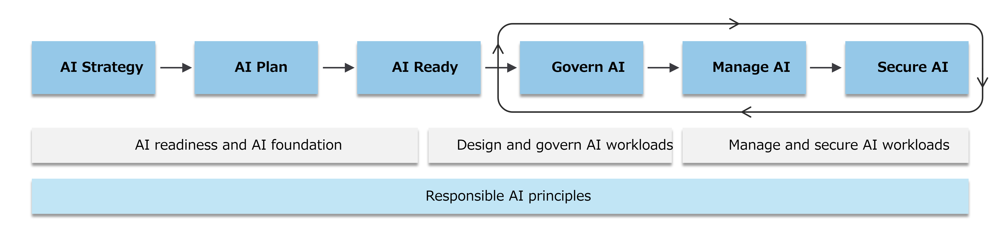

# Week 4: Scaling

Week 4 focuses on how to scale the partner's solution. By the end of Week 3, the MVP should at least be built, so we can discuss how to adapt it to the production environment and how to scale AI apps based on business customer needs. During this process, we will discuss what Microsoft Azure workloads are suitable. Microsoft recommends the Cloud Adoption Framework (a.k.a CAF) and the Well-Architected Framework (a.k.a W-AF), and we can provide these frameworks to partner companies.
Microsoft has CAF for AI Apps and define Landing Zone for using AI Apps on Microsoft Azure. This framework utilize how to scale, how to monitor and how to optimize partner's AI Apps with Responsible AI.

# Week 4: Goals
As you progress beyond the MVP stage, scaling AI applications is critical for ensuring uninterrupted service. 
Customers expect certain level of performance, reliability, and seamless integration with production environments.
Microsoft provides architecture design sessions, best practices, and tools, including Cloud Adoption Framework (CAF) and AI-specific landing zones, to support scaling efforts. These resources help partners align their technical scaling strategy with business growth objectives.
This chapter focuses on optimizing AI workloads, ensuring high availability, and integrating security measures to meet enterprise-level requirements.

# Overview
By the end of Week 3, partners should have built a Minimum Viable Product (MVP) of their AI application. The next step is transitioning from MVP to a scalable production environment that meets business customer demands. Microsoft provides structured guidance through CAF and W-AF, helping partners optimize their AI workloads, ensure high availability, enhance security, and integrate DevOps strategies for continuous deployment.

## This week focuses on:
- Defining a production-ready architecture for AI applications
- Leveraging Microsoft Azure services for AI scalability, optimization, and security
- Using AI-specific Landing Zones to align technical scaling with business objectives
- Addressing enterprise security and compliance requirements

# Key Topics & Activities
## 1. Architecture Design for Scaling AI Applications
- Session Objective: Define an architecture that ensures AI models and applications can scale seamlessly while maintaining performance and cost efficiency.

### Key Discussion Points:
- Review of Current AI Architecture: Identify areas that may become bottlenecks as traffic grows.
  - Be aware of limitation of the subscription(s). Take into account token quotas & rate limits, response time variability, and model availability.   
- AI Landing Zone on Azure: Explore Microsoft AI CAF and how to establish an AI-specific Landing Zone.
- Scalable Design Patterns: Utilize Azure AI, Azure Data, and Azure App services to build an adaptive architecture.
- Compute Scaling Considerations: Choose between Azure Kubernetes Service (AKS), Azure Container Apps, or serverless AI functions for optimal compute management.
- Data Handling for Scale: Discuss scalable data lakes, caching mechanisms, and distributed processing using Azure Synapse Analytics and Azure Cosmos DB.
- Infrastructure as Code (IaC): Implement Azure Resource Manager (ARM) or Terraform templates for automated, repeatable deployments.

### Related Github Repository:
- https://github.com/Azure/Enterprise-Scale
- https://github.com/jostrm/azure-enterprise-scale-ml

### Hands-on Activity:
- Define a scalable AI architecture diagram using Azure AI Landing Zone.
- Break down the MVP architecture into modular, scalable components.
- Create a blueprint for scaling AI models and inference services.

## 2. Optimization for AI Workload Scalability
- Session Objective: Implement best practices for AI application scaling to balance performance and cost.

### Key Discussion Points:
- Cost-Efficient Scaling Strategies: Leverage Azure Auto-Scaling, Spot VMs, and serverless AI functions.
- Distributed AI Workloads: Use Azure AI Batch Processing for handling intensive ML workloads.
- Latency Optimization: Implement Azure Front Door and Azure CDN for fast content delivery.
- Optimizing AI Models: Use ONNX Runtime, Model Compression, and Azure AI Hardware Acceleration.

### Related Github Repository:
- https://github.com/microsoft/AIReferenceArchitectures

### Hands-on Activity:
- Configure Azure Load Balancer & Auto-scaling for an AI service.
- Implement data caching strategies using Azure Redis.
- Optimize API endpoints using Azure API Management.

## 3. Performance Enhancements for AI Applications
- Session Objective: Improve AI application responsiveness and reliability under high demand.

### Key Discussion Points:
- AI Model Hosting Choices: Compare Azure ML Managed Endpoints vs. AKS vs. Serverless Inference.
- Data Processing at Scale: Use Azure Data Factory & Synapse Analytics for large-scale processing.
- Implementing Caching & Indexing: Reduce inference latency using Azure Redis Cache.
- Monitoring & Automated Scaling: Set up Azure Monitor and Application Insights to track AI performance.

### Related Github Repository:
- https://github.com/Azure/AI-in-a-Box

### Hands-on Activity:
- Configure Azure Monitor for AI model performance tracking.
- Implement load testing on AI APIs to measure inference speed.
- Set up Azure Logic Apps to automate model retraining and scaling.

## 4. Security & Compliance for Scaling AI
- Session Objective: Strengthen AI security posture and ensure compliance with industry standards.

### Key Discussion Points:
- Implementing Role-Based Access Control (RBAC): Enforce least privilege access to AI models.
- Data Encryption Strategies: Use Azure Key Vault for model and API secrets management.
- Compliance Frameworks: Align with GDPR, ISO 27001, and SOC 2 using Microsoft Purview.
- Threat Protection: Deploy Azure Defender for AI for real-time anomaly detection.

### Related Github Repository:
- https://github.com/Azure/Enterprise-Scale
- https://github.com/Azure/aoai-apim

### Hands-on Activity:
- Implement RBAC for AI services on Azure.
- Set up anomaly detection alerts using Azure Security Center.
- Secure Azure ML workspaces and model storage.

## 5. Continuous Integration & Deployment (CI/CD) for AI Applications
- Session Objective: Enable automated, efficient AI application deployment to production.

### Key Discussion Points:
- Defining a CI/CD Pipeline for AI: Use GitHub Actions or Azure DevOps for AI model deployment.
- Model Versioning & Governance: Track AI models with Azure ML Model Registry.
- Automating Model Deployment: Use MLOps strategies for continuous training & inference.
- Monitoring Model Drift & Performance: Set up alerts for AI model performance degradation.

### Related Github Repository:
- https://github.com/Azure/aoai-apim 

### Hands-on Activity:
- Deploy a sample AI model using an Azure DevOps CI/CD pipeline.
- Configure auto-rollback for AI models if performance drops.
- Automate model retraining using Azure ML Pipelines.

# Final Deliverables & Expected Outcomes
By the end of Week 4, partners should have:
- A scalable AI architecture blueprint ready for production.
- Optimized AI workloads for high availability and cost-efficiency.
- Implemented security best practices and compliance measures.
- A working CI/CD pipeline for continuous AI application deployment.
- Full understanding of CAF/W-AF principles for scaling on Azure.

**For Internal**
I think Week4 needs to show how Microsoft thought for scaling from W-AF and CAF to use Microsoft Azure. Especially AI CAF has Landing Zone for partners.
What contents should we provide for partner? Or wihtout nothing contents and only discuss to define the goal of scaling to acheieve partner's business growth?

**CAF for AI**
https://learn.microsoft.com/en-us/azure/cloud-adoption-framework/scenarios/ai/

## Next Steps
Partners will use the insights from this phase to finalize their AI applications for production deployment. Week 5 will focus on refining security, optimizing performance, and preparing for a successful release.
