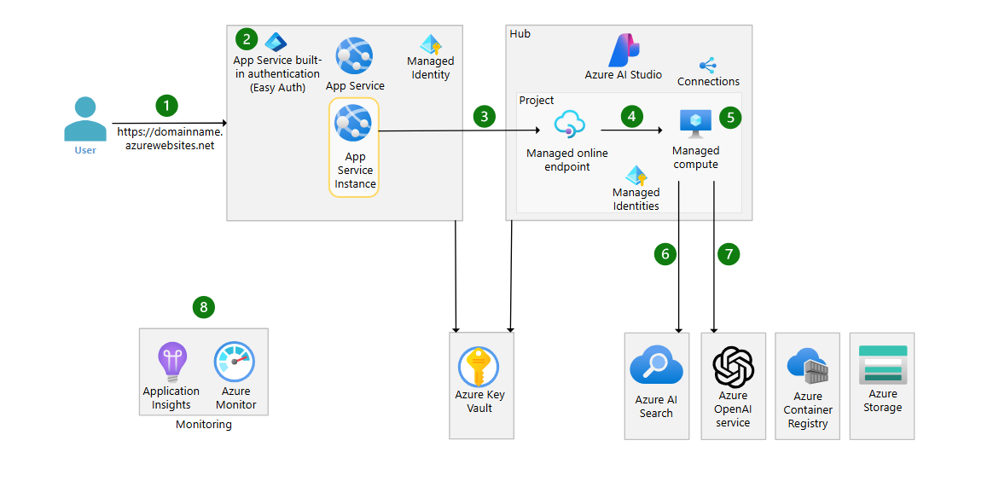

# Week 5: Deploying AI to Production


- [Week 5: Deploying AI to Production](#week-5-deploying-ai-to-production)
  - [Goals](#goals)
  - [Detailed Contents](#detailed-contents)
    - [1. Production Deployment Essentials](#1-production-deployment-essentials)
      - [What's Included:](#whats-included)
      - [Key Resources:](#key-resources)
    - [2. Overview of Operational Frameworks (MLOps and GenAIOps)](#2-overview-of-operational-frameworks-mlops-and-genaiops)
    - [3. Monitoring, Observability, and Automation](#3-monitoring-observability-and-automation)
      - [Monitoring Objectives:](#monitoring-objectives)
      - [Automation Objectives:](#automation-objectives)
      - [Tools and Resources:](#tools-and-resources)
    - [4. Operational Excellence with GenAIOps](#4-operational-excellence-with-genaiops)
      - [GenAIOps Maturity Levels:](#genaiops-maturity-levels)
      - [Maturity Level Self-Assessment and Resources:](#maturity-level-self-assessment-and-resources)
    - [5. Advanced Copilot \& Chat Application Operations](#5-advanced-copilot--chat-application-operations)
      - [Key Topics:](#key-topics)
      - [Specific Resources:](#specific-resources)
  - [Next Steps](#next-steps)
  - [Agentic AI and AgentOps](#agentic-ai-and-agentops)
    - [Patterns for AI Agents:](#patterns-for-ai-agents)

In **Week 5**, our primary aim is to equip you with the tools and knowledge to deploy and operationalize AI workloads effectively in production environments on Microsoft Azure, emphasizing quality assurance, security best practices, and operational excellence through GenAIOps/MLOps.

---

## Goals

1. **Quality and Secure Deployment**
   - Ensure robust security controls, observability, and consistent quality in AI production deployments.

2. **Operational Excellence**
   - Achieve efficiency and resilience through structured operational frameworks such as MLOps and GenAIOps.

3. **Automated Monitoring & Management**
   - Implement automated monitoring, reporting, tracing, and appropriate change management to maintain AI model performance.

---

## Detailed Contents

### 1. Production Deployment Essentials

Gain clarity on the critical components, security considerations, and operational factors required when moving an AI application to a production environment.

#### What's Included:

- **Deployment Best Practices:** Guidelines for moving your AI applications smoothly into production.
- **Security Framework Highlights:** Integration of foundational and advanced security practices recommended by Microsoft.

#### Key Resources:

- [Azure Well-Architected Framework (AI)](https://learn.microsoft.com/en-us/azure/well-architected/ai/mlops-genaiops)
- [MLOps Solution Accelerator](https://github.com/Azure/mlops-v2)


---

### 2. Overview of Operational Frameworks (MLOps and GenAIOps)

Understand the operational approaches specifically tailored for AI, focused on the rigor of managing AI models, especially Generative AI and Large Language Models (LLMs).

Operational Framework Types:

- **DevOps:** Application lifecycle management through CI/CD pipelines.
- **DataOps:** Covers end-to-end management of data assets and ETL/ELT processes.
- **MLOps:** Operationalizes the entire machine learning life cycle.
- **GenAIOps (sometimes known as LLMOps):** Specialized for generative AI and language models, encompassing prompt engineering, model monitoring, retraining, and adaptation.

**Expected Outcomes:**

- Consistency and reproducibility of processes.
- Continuous model accuracy and relevance.
- Effective governance and risk management.
- Responsive change management for adapting to model drift.
- Robust automation and monitoring.

---

### 3. Monitoring, Observability, and Automation

AI applications face inherent unpredictability. Continuous monitoring and automated response are essential for maintaining integrity, relevance, and security.

#### Monitoring Objectives:

- **Continuous Quality Assurance**
  - Internal feedback loops for anomaly detection.
  - Relevance assessment for generative AI applications.

- **Proactive Security Management**
  - Content moderation and prompt inspection.
  - Identify attempts to manipulate models.

- **Performance and Reliability Monitoring**
  - Monitoring infrastructure health and AI inference endpoints.

#### Automation Objectives:

- Ensure repeatable, consistent workflows.
- Automate deployment via CI/CD pipelines.
- Automate model retraining, adaptation, and version management.

#### Tools and Resources:

- [Data Collection from Models in Production](https://learn.microsoft.com/en-us/azure/machine-learning/concept-data-collection)
- [Azure ML Model Monitoring](https://learn.microsoft.com/en-us/azure/machine-learning/concept-model-monitoring)
- [Azure AI Foundry - Content Filtering](https://learn.microsoft.com/en-us/azure/ai-studio/concepts/content-filtering)
- [Azure Pipelines for Machine Learning](https://learn.microsoft.com/en-us/azure/machine-learning/how-to-devops-machine-learning)

---

### 4. Operational Excellence with GenAIOps

Focus explicitly on GenAIOps methodology, which is critical for effective management of generative AI models and workloads.

#### GenAIOps Maturity Levels:


Assess where you currently stand and strategically implement steps toward operational excellence.

#### Maturity Level Self-Assessment and Resources:

- **[Take a Self-Assessment](https://learn.microsoft.com/en-us/assessments/e14e1e9f-d339-4d7e-b2bb-24f056cf08b6/)**
  - Levels:
    - **1 - Initial (0-9):** 
      - Learn prompt engineering and basic metrics 
      - [Prompt Engineering Techniques](https://learn.microsoft.com/en-us/azure/ai-services/openai/concepts/advanced-prompt-engineering)
    - **2 - Defined (10-14):**
      - Develop systematic operations, integration & evaluation 
      - [LLMOps Step-by-Step Workshops](https://github.com/microsoft/llmops-workshop)
    - **3 - Managed (15-19):**
      - Implement fine-tuned models; optimize deployments and assets
      - [Fine-tune models with Azure ML](https://learn.microsoft.com/en-us/training/modules/finetune-foundation-model-with-azure-machine-learning/)
    - **4 - Optimized (20-28):**
      - Operational excellence, innovation, community leadership
      - [Stay Updated with Azure AI Foundry](https://learn.microsoft.com/en-us/azure/ai-studio/concepts/evaluation-approach-gen-ai)

---

### 5. Advanced Copilot & Chat Application Operations

Understand specific operational considerations unique to advanced conversational AI applications.

#### Key Topics:

- Multitenancy and data segregation strategies
- AI-specific load balancing and resilience strategies
- Prompt chaining and library governance
- Security management specific to conversational AI
- Responsible AI practices and failure mode recognition

#### Specific Resources:

- [AI and ML multitenant approaches](https://learn.microsoft.com/en-us/azure/architecture/guide/multitenant/approaches/ai-ml)
- [Content Safety in Azure AI](https://learn.microsoft.com/en-us/azure/ai-services/content-safety/overview)
- [Responsible AI Tools in LLMOps](https://azure.microsoft.com/blog/infuse-responsible-ai-tools-and-practices-in-your-llmops/)
- [Prompt Flow Integration](https://learn.microsoft.com/en-us/azure/ai-studio/how-to/prompt-flow)
- [GenAI Application Evaluation](https://learn.microsoft.com/en-us/azure/ai-studio/concepts/evaluation-approach-gen-ai)


---

## Next Steps

➡️ Review production deployment essentials and Microsoft’s recommended well-architected guidelines.

➡️ Familiarize yourself thoroughly with GenAIOps concepts and perform the maturity assessment to pinpoint your current capabilities and identify improvement opportunities.

➡️ Start applying practical monitoring, observability, and automation tools integrated within the Azure AI environment.

➡️ Incorporate operational strategies specific to conversational and copilot AI applications, emphasizing prompt engineering, multitenancy, and Responsible AI practices.

➡️ Share your findings and experiences within your operational teams, continuously improving your AI deployment, monitoring, and operational practices.

---

Completing **Week 5** subjects will equip you with operational excellence in deploying, managing, and scaling AI workloads in secure production environments, accelerating your AI-driven business growth and setting a strong foundation for the long-term success of your AI initiatives.

## Agentic AI and AgentOps
AI agents take generative AI a crucial step forward, enabling systems to perform sophisticated tasks autonomously or in partnership with employees. From analyzing shipping invoices to managing customer returns, agents tackle tasks around the clock, streamlining essential workflows.

Think of agents as specialized digital co-workers, each trained specifically to handle critical duties—from tracking supply-chain logistics to guiding technicians with real-time product updates.

Agents, equipped with memory capabilities, permissions management, and secure access to tools like Teams and PowerPoint, can maintain context and continuity across tasks. For IT and human resources, Employee Self-Service Agents ease everyday support requests. In sales and logistics, dedicated agents proactively organize leads, monitor inventory, and generate insights.

This growing AgentOps movement represents a fundamental shift in how tasks are carried out in every industry. As AI autonomously handles complex assignments clearly and consistently, human roles evolve toward strategy, creativity, and collaboration—ensuring productivity and innovation for the future workplace.

### Patterns for AI Agents:

#### 1. Reflection Pattern
**Description:** The agent reviews and critiques its own outputs to iteratively identify improvements and enhance output quality.
**Diagram:**
```
[Input] → [Initial Response] → [Self-Evaluation] → [Refined Response]
```
**Use Cases:** Content generation, code review, quality assurance
**Reference:** [Reflection: An Essential Ingredient for AI Agents](https://arxiv.org/abs/2305.14802)

#### 2. Tool Use Pattern
**Description:** The agent leverages external resources (e.g., web search, APIs, databases, code execution) to retrieve, process, or analyze additional information and take external actions.
**Diagram:**
```
[Agent] → [Tool Selection] → [API/Database/Web] → [Process Response] → [Final Output]
```
**Use Cases:** Data analysis, web research, application integration
**Reference:** [Toolformer: Language Models Can Teach Themselves to Use Tools](https://arxiv.org/abs/2302.04761)

#### 3. Planning Pattern
**Description:** The agent formulates structured, multi-step procedures toward achieving complex goals, and sequentially executes these steps.
**Diagram:**
```
[Goal] → [Plan Generation] → [Step 1] → [Step 2] → ... → [Final Output]
                     ↓              ↓
                [Evaluation]  [Correction]
```
**Use Cases:** Project management, complex problem solving, task automation
**Reference:** [ReAct: Synergizing Reasoning and Acting in Language Models](https://arxiv.org/abs/2210.03629)

#### 4. Multi-Agent Collaboration
**Description:** Multiple specialized agents work together, each with distinct roles, to solve complex problems.
**Diagram:**
```
[User Request] → [Orchestrator Agent]
                     ↓
    [Specialist Agent 1] [Specialist Agent 2] [Specialist Agent 3]
            ↓                   ↓                     ↓
    [Task 1 Results]    [Task 2 Results]     [Task 3 Results]
                     ↓
            [Integrated Response]
```
**Use Cases:** Complex system design, research projects, enterprise solutions
**Reference:** [AutoGen: Enabling Next-Gen LLM Applications via Multi-Agent Conversation](https://arxiv.org/abs/2308.08155)

#### 5. Memory-Augmented Pattern
**Description:** The agent maintains and utilizes both short-term and long-term memory to provide context-aware responses.
**Diagram:**
```
[Current Input] → [Memory Retrieval] → [Context Integration] → [Response Generation]
      ↓                                      ↑
[Memory Update] ← [Relevance Assessment]
```
**Use Cases:** Personalized assistants, continuous learning systems
**Reference:** [Retrieval-Augmented Generation for Knowledge-Intensive Tasks](https://arxiv.org/abs/2005.11401)

#### 6. Human-in-the-Loop Pattern
**Description:** The agent collaborates with human users, requesting clarification or approval when needed.
**Diagram:**
```
[Agent] → [Action Proposals] → [Human Feedback] → [Execution/Refinement]
```
**Use Cases:** Critical decision making, creative processes, sensitive operations
**Reference:** [The Role of Human Feedback in AI Systems](https://arxiv.org/abs/2210.12082)

#### Recommended Resources:
- [Patterns for Building LLM-based Systems & Products](https://eugeneyan.com/writing/llm-patterns/)
- [AI Agent Patterns](https://www.agentops.ai/patterns)
- [LLM Powered Autonomous Agents](https://lilianweng.github.io/posts/2023-06-23-agent/)
- [Microsoft's Guidance on AI Agents](https://learn.microsoft.com/en-us/semantic-kernel/agents/)

#### Visual Representation of Agent Architecture:
```
┌─────────────────────────────────────────────────────┐
│                   User Interface                    │
└─────────────────────────┬─────────────────────────┘
                          │
┌─────────────────────────▼─────────────────────────┐
│                Orchestration Layer                │
│  ┌─────────────┐  ┌──────────────────────────┐  │
│  │   Memory    │  │       Planner            │  │
│  └─────────────┘  └───────────┬──────────────┘  │
│           │                   │                   │
│  ┌────────▼───────┐  ┌────────▼───────┐  ┌──────┴───────┐
│  │  Tool Use     │  │  Reasoning     │  │  Reflection   │  │
│  │  (APIs, Web,  │  │  & Planning    │  │  & Learning   │  │
│  │   Databases)  │  │                │  │               │  │
│  └────────┬───────┘  └────────┬───────┘  └──────▲───────┘
│           │                    │                   │
└───────────┼────────────────────┼───────────────────┘
            │                    │
┌───────────▼────────────────────▼───────────────────┐
│                External Systems & Data             │
└───────────────────────────────────────────────────┘
```

- **Multi-Agent Collaboration:** 
  Multiple agents coordinate, delegate tasks, engage in dialogue, evaluate each other's contributions, and synthesize diverse perspectives to achieve superior, collaborative outcomes.

- **Memory & Knowledge Retention:**
  Agent maintains a structured memory of past experiences, interactions, and data, enabling continuous learning and adaptation through reuse and recall.

- **Adaptive Goal Management:**
  Agent dynamically prioritizes, updates, and manages objectives based on emerging insights, environmental changes, or updated conditions.

- **Human-in-the-Loop Integration:** 
  Agent regularly collaborates, coordinates, or solicits input from human experts, integrating human oversight or guidance to refine outputs and decision-making.
